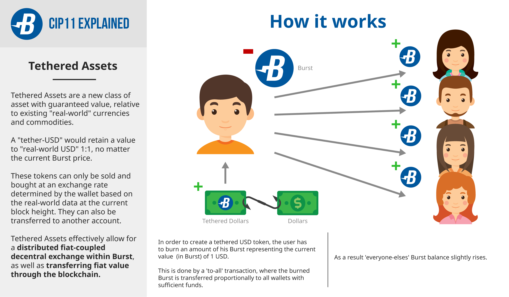

    CIP: 11
    Title: Tethered Assets
    Author: PoCC/rico666 (bots@cryptoguru.org)
    Comments-Summary: No comments yet.
    Comments-URI: https://github.com/PoC-Consortium/CIPs/wiki/Comments:CIP-0011
    Status: Draft
    Type: Consensus (hard fork)
    Created: 2018-07-16

## Abstract

Creating an asset today requires the issuer to spend 1000 Burst, but other than that there are virtually no limits to the asset as such. A vast number of asset tokens can be created without further restrictions. It is upon the asset issuer to provide sufficient warranties that these tokens represent adequate "real-world value".

More often than not such warranties or collaterals could not be given and even less so could they be enforced by the shareholders.

Tethered Assets is a new class of asset with guaranteed value - relative to "real-world" currencies and commodities. An application could be the creation of a tethered-USD asset whose tokens - say - "tether-USD" would retain a value to "real-world USD" 1:1, no matter the current Burst price. These tokens could also not be sold/bought by giving bid/ask orders, they could only be sold/bought at an exchange rate determined by the wallet based on the real-world data (see [CIP10](cip-0010.md)) at the current block height.

Creating such an asset (or adding tokens to it), would imply to "buy" these from the network. Again at a wallet-determined exchange rate, a "To-All Transaction" (see [CIP9](cip-0009.md)) would basically disseminate the Burst funds used to create/extend this asset among all Burst addresses above a certain Dust threshold (see [CIP8](cip-0008.md)).

In a sense, creating tethered assets can only be done by the entire Burst network, therefore any individual doing so, must buy them from the entire network. This is done with a "To-All transaction" and essentially means that any tethered token created this way was bought at the time of its creation at a value representing the value of the corresponding real-world token.

In the scope of this process, all Burst addresses above a certain dust-threshold can be considered some sort of staking addresses and as such they define the proportional gain of the funds sent in any To-All transaction.

## Motivation

Asset tokens are [colored coins](https://burstwiki.org/wiki/Colored_Coins) that can represent anything. Their intrinsic value, however, is zero. So any value they have depends on which promises the asset issuer made, how transparent asset backing and operation is, etc.

There is no guarantee whatsoever, that a given asset token will retain some value in BURST, let alone in some Fiat currency or even a commodity such as gold.

Tethered assets on the other hand do guarantee exactly that: A tethered USD-token will have a value that is 1:1 equivalent to a real-world USD from its creation on over its whole - indefinite - life time.

Such an asset can be used as a hedge in times of falling Burst prices (against Fiat) and effectively allows for a distributed Fiat-coupled decentral exchange within Burst.

Because these tokens are guaranteed to retain equivalent value to some existing Fiat currencies, the transfer of these tethered tokens is equivalent to payment in the real world.

These tokens also are not created out of thin air, but they need to be bought "from the community in its entirety" - that's where To-All transactions come in.

In short, this system will equip burst with a strong anchor in the real fiscal world in a decentral ungameable way.

This feature also complements the current Dymaxion specification and will allow for "Tethered Tokens" within a DL.

## Specification



### Buying and Creation

Depending on the real-world data (see [CIP10](cip-0010.md)) stored in the current block, we can immediately think of issuing the corresponding assets with tokens based on the currencies or commodities tracked by the blockchain.

Let's assume we have the exchange rates for USD, EUR and 1g of gold in relation to BURST in the data section as defined by CIP10. There are two possible ways to acquire a tethered asset equivalent to these:

1. buying an existing (amount of) token(s) from someone offering to sell them at the current exchange rate as defined by the blockchain
1. creating a new (amount of) token(s) for the given asset by buying them "from the community" through a "To-All Transaction"

Both ways are absolutely equivalent in terms of cost. Any user wanting to purchase/create these tokens will pay exactly the same price either way. The 2nd way is always open if there are no such tokens for sale at current market price. Therefore it is also the way to bring these tokens into existence.

Let C₁ ... Cₙ be commodities tracked by the blockchain, then Vₙ(Cₓ) is the Burst value of commodity Cₓ at block height n

Buying the amount of m (can be a fraction divisible to 8 places) units of Cₓ will result in the cost of m * Vₙ(Cₓ) Burst

This cost can either be paid by either buying already existing tokens of this commodity directly from a seller - at this consensus-determinded price. Only if no tokens are available for sale, new tokens of this commodity can be created at the same cost by issuing a "To-All transaction" of

```
m * Vₙ(Cₓ) Burst
```

Provided the buyer has enough liquidity of course, these Burst would be dissemiated across all addresses holding Burst over the defined dust threshold, but otherwise the computation of the buying sum to be transferred would go down to 1 Planck in precision.

As a result of buying TA tokens, the buyer would simply receive the TA tokens and the seller would receive the Burst according to curent market price - exactly as the Asset Exchange buy/sell process works today.

As a result of creating TA tokens, the creator would burn/lose the respective amount of Burst and "everybody else" will have their Burst balance raised proportionally. (see [CIP9](cip-0009.md))

### Destroying TA Tokens

By design, there is no way to destroy a TA token once it has come into existence. This would require a kind of "reverse burn" or from-all transaction and in this respect the functionality cannot be symmetric.

As such, tethered values are infinite and keep their value as long as their real-world counterparts keep theirs.

## References

* [CIP8 Define Tx and Balance "Dust"](cip-0008.md)
* [CIP9 To-All Transactions](cip-0009.md)
* [CIP10 Anchor Real-World Data in Blockchain](cip-0010.md)

## Copyright

This document is placed in the public domain.
