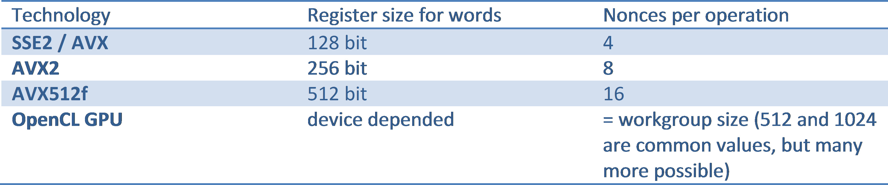
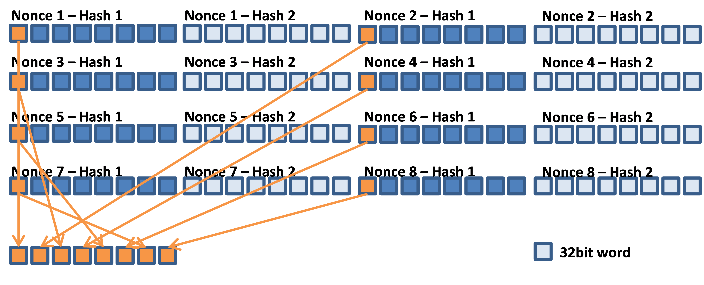
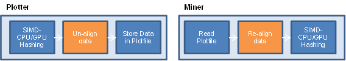
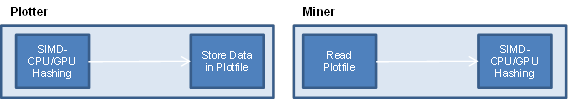

    CIP: 16
    Title: PoC2.X16 - A New Optimized Plot File Format
    Author: PoCC/JohnnyFFM
    Comments-Summary: general pro-sentiment
    Comments-URI: https://www.reddit.com/r/burstcoin/comments/a1qyoq/cip_announcement_poc2x16_a_new_optimized_plot/
    Status: Accepted
    Type: Enhancement
    Created: 2018-11-30

## Abstract

This CIP is about a new plot file format further optimising the
current plot file format (PoC2) for data parallelism. It is important
to understand that this format is optional. There is no need to
convert existing files. PoC2.X16 can co-exist with PoC2. It’s a format
for enthusiasts and will perform better than PoC2, i.e. plotting and
mining will be faster. It doesn’t require a fork and is only affecting
plotting and mining software. PoC2 can be converted to PoC2.X16 and
vice versa.

## Motivation

Creating or mining plot files involves performing the same task
(hashing) on different data items. Plotting is hashing an account id
with different seeds (nonces) and mining is hashing a fraction
(1/4096, aka a “scoop”) of the data generated seeded with the last
generation signature. For maximum speed, current plotting and mining
software is already using data parallelism and
concurrency. Concurrency is achieved by distributing work to several
threads and performing computations on several CPU and/or GPU cores in
parallel. Data parallelism is achieved by using SIMD extensions of
modern CPUs or by using GPUs. However, although we are using data
parallelism, data in a plot file is not aligned for this form of
parallel computing creating unnecessary overhead.

From a top level view, the current process is:

Plotters are using SIMD-CPUs or GPUs to generate plot file data. The
data produced by these computation units is aligned for data
parallelism but is then algorithmically unaligned before being
physically stored in a plot file. Miners are then reading this
unaligned data and algorithmically realign it before performing
hashing operations (figure 1). The Poc2.X16 format targets to get rid
of these superfluous un- and realignment operations (figure 2).

Optimisation

To understand the new format it is necessary to acquire a thorough
understanding of the current PoC2 format, of the steps involved in
creating plotfiles and of the underlying hashing algorithm
shabal256. I recommend reading the article on plot file creation on
burstwiki[1] and the technical specification of the Shabal
algorithm[2]. Additionally it is beneficial to understand how memory
works, how data is accessed and what a cache line is[3]. I also
recommend reading the Nvidia OpenCL Best Practices Guide[4] with a
focus on data coalescence

When hashing data with Shabal, data is first split into message blocks
of 512bit length. Each message contains 16 words (32bit integers) and
all arithmetic operations are performed on these words. Let’s have a
look at what happens if we want to hash plot file data in parallel
when mining and assume we are using an AVX2 CPU. AVX2 allows
processing eight nonces in parallel (AVX2 supports up to eight 32bit
integer operations in parallel). We are reading a scoop for 8 nonces
of the plotfile (8 x 2 x 32byte shabal hashes, i.e. 4096 bit of data
comprising 128 words) and want to perform a single arithmetic
operation of the Shabal algorithm. Let’s assume we need the first word
of each nonce. Since nonces are stored sequentially, we find the first
word at bit offset 0, the second word at bit offset 512, third at 1024
and so on. We then read all those words into a contiguous buffer
(gathering operation) to then load the data into the SIMD
registers. Once in the registers, we can perform SIMD-operations. The
gathering of data is quite an expensive operation. To gather the data
for 8 nonces we need to obtain 8 cache lines, 64 byte each, coalesce
the data and store it.

So rather than performing this operation every time we load data into
SIMD registers, it would make more sense to directly store the data
such that words are aligned in sequence. We would then just need to
load a single cache line and that’s it. This makes even more sense
when we take into account that the data is already word-wise aligned
when we are creating plot files using a SIMD-CPU or a GPU. There is no
need to un-align data before saving it to disk.

When we think about aligning data on word level, we would need to
think about the data of how many nonces we want to align. For the
above example with AVX2 it seems to make sense to align the data of 8
nonces. But what if we use SSE2, AVX or AVX512f? Or even a GPU? Let’s
have a look at the number of words processed in parallel for each
technology:

A plot file format for every technology? No. Let’s use our knowledge
about memory. The smallest unit we can access in memory is a cache
line with 64byte = 512bit. So a cache line stores 16 words and
therefore it makes sense to align data in blocks of 16 nonces. To load
data for SSE for example, we would load a cache lines comprising 16
words of 16 nonces but only use 4 for the computation. Depending on
CPU cache size we might be lucky and don’t have to read the cache line
again when processing the next 4 nonces. The same holds for AVX2 but
accessing 8 nonces. AVX512f is a perfect fit: a single cache line fits
an AVX512f register. GPU is slightly different. For a workgroup-size
of 1024 for example, we would need to read 64 cache lines. It doesn’t
matter if the data is aligned to 16 nonces or to 1024 nonces, in both
cases the number of cache line reads is identical. So even for GPUs 16
nonces is an excellent fit.

### PoC2.X16 format specifications

So how does the PoC2.X16 plot file format look like? First, a PoC2.X16
plot file holds a multiple of 16 nonces, i.e. its size is a multiple
of 4MiB. Scoop data is sequentially stored just like in optimised
PoC2. However, the data inside a scoop is stored and addressed
differently:

    PoC2 Adressing (in words):
    address (nonce, hash, word) = (nonce * SCOOP_SIZE_WORDS + hash * HASH_SIZE_WORDS + word)

    PoC2.X16 Adressing (in words):
    Address (nonce, hash, word) = (nonce / 16) * 16 * SCOOP_SIZE_WORDS + (hash) * 16 * HASH_SIZE_WORDS
                                + word * NONCES_VECTOR + (nonce % 16))

    SCOOP_SIZE_WORDS = 16 , HASH_SIZE_WORDS = 8
    nonce = 0…number of nonces in file, hash = 0..2 (first hash or second hash), word = 0..8

For the filename, we suggest the file name extension “.X16”.

## References

[1]https://burstwiki.org/wiki/Technical\_information\_to\_create\_plot\_files
[2]The Saphir Project: Shabal, a Submission to NIST's Cryptographic Hash Algorithm Competition https://www.cs.rit.edu/\~ark/20090927/Round2Candidates/Shabal.pdf
[3] Ulrich Drepper: What every programmer should know about memory, https://people.freebsd.org/\~lstewart/articles/cpumemory.pdf
[4]https://www.nvidia.com/content/cudazone/CUDABrowser/downloads/papers/NVIDIA\_OpenCL\_BestPracticesGuide.pdf

## Copyright

This document is placed in the public domain.
