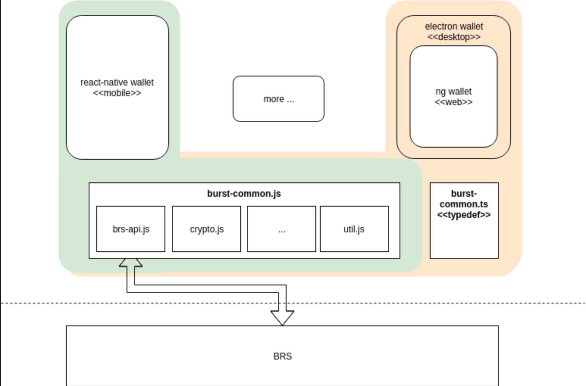

    CIP: 18
    Title: Cross-Platform Wallet UI
    Author: blankey1337, ohager
    Comments-Summary: No comments yet.
    Comments-URI: https://github.com/burst-apps-team/CIPs/wiki/CIP-0018:-Comments
    Status: Draft
    Type: Standards Track
    Created: 2019-01-06

## Motivation

Currently, the Burst desktop wallet is a fork of the NXT wallet which was built in 2014. It is written in jQuery and supports most of the features of the Burst blockchain. In the past few years, JavaScript applications have evolved in capabilities and standards. Without proper support, front-end applications tend to age quickly; and the Burst desktop wallet is no exception. 

The current Burst desktop wallet has a fair share of bugs, is hard to maintain, and uses outdated libraries that could pose a security risk. Further, because the desktop wallet uses old technology, there are many advantageous new features and patterns that Burst wallet developers are missing out on.

As for mobile, there are currently two Burst mobile wallets: (1) Android (launched), and (2) iOS. The Android wallet was developed in JavaScript by a previous development team, where the iOS wallet is being developed in Objective-C by a community member. Currently, none of the Burst wallets (desktop, ios, android) share any code or similar conventions.  

## Abstract

We propose to revamp the Burst wallets using the latest application development technologies and best practices. Further, we propose an application architecture that will support multiple platforms: desktop (Windows, OSX, Linux), mobile (Android and iOS), and web (in-browser). Such a platform will improve collaboration, streamline development, and simplify the software development lifecycle of Burst wallets into the future.

## Specification

### Multi-Platform Wallet Architecture

A multi-platform application architecture is made possible through a few key front-end technologies: [React Native](https://facebook.github.io/react-native/), [Angular](https://angular.io/), and [Electron](https://electronjs.org/). By using these technologies in conjunction, Burst wallet developers will enjoy a modern application development workflow without sacrificing the quality of the end-product. 

### Reference Diagram

See it live at https://github.com/ohager/ashes. 

### Desktop (Standalone)

A desktop application will be built using Angular/TypeScript, and exported to an executable/installer using Electron. Angular is a framework for building rich JavaScript apps, and Electron is tool used to generate standalone installers for OSX/Windows/Linux from JavaScript apps. We picked Angular and TypeScript due to its declarative, opinionated nature and strict conventions. Compared to other front-end frameworks, we believe Angular is better suited for a loosely-organized open source project like this one. 

### Web

The desktop application will be a [Progressive Web Application](https://developers.google.com/web/progressive-web-apps/), and as such, will run in the browser. This will be the same desktop application that gets bundled into a standalone installer using Electron (see above). As a result, we basically get this for free.

### Mobile

A mobile app for Android and iOS will be developed on a single codebase using React Native, a framework for building native apps using JavaScript. It provides a component library suitable for rich native application development while also providing useful hooks into mobile SDKs. 

### Common Burst JS library

All proposed wallet implementations use Javascript (ES6+, TS) as their basic language. That way it's possible to create a common code base as a library that can be used for _all_ UI implementations. The library contains an abstraction of the Burst API (BRS), various cryptographic classes/function, and further reusable functionalities. Done right, we can reduce future development times drastically, while guaranteeing a constant level of quality.

## References

* [React Native](https://facebook.github.io/react-native/)
* [Angular](https://angular.io/)
* [Electron](https://electronjs.org/)
* [Progressive Web Applications](https://developers.google.com/web/progressive-web-apps/)

## Copyright

This document is placed in the public domain.
